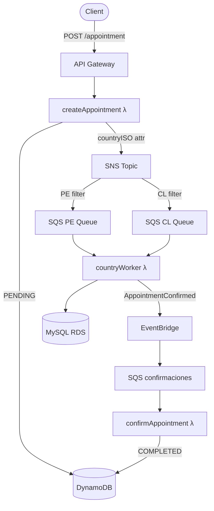

[](https://github.com/apchavez/aws-typescript/actions/workflows/ci.yml)
[](https://sonarcloud.io/summary/new_code?id=apchavez_aws-typescript)
[](https://sonarcloud.io/summary/new_code?id=apchavez_aws-typescript)
[](https://sonarcloud.io/summary/new_code?id=apchavez_aws-typescript)

# Clinic Scheduling Platform

Backend platform for medical appointment scheduling built with **TypeScript**, **AWS Serverless**, and **Clean Architecture**.

This project simulates a production-grade healthcare booking workflow using asynchronous event-driven processing, multiple data stores, and scalable cloud services.

> Designed as a portfolio project to demonstrate backend engineering skills in distributed systems, serverless architecture, and maintainable code structure.

---

## Tech Stack

| Layer | Technology |
|---|---|
| Language | TypeScript / Node.js 20 |
| Runtime | AWS Lambda (nodejs20.x, arm64) |
| API | API Gateway HTTP API |
| State store | DynamoDB |
| Relational store | MySQL 8 on RDS (per-country) |
| Messaging | SNS → SQS fan-out |
| Event bus | EventBridge |
| IaC / Deploy | Serverless Framework v4 |
| Local dev | serverless-offline, Docker |
| Testing | Jest + ts-jest |
| Docs | OpenAPI / Swagger |

---

## Architecture



> **This project uses serverless architecture on AWS Lambda. Kubernetes does not apply.**

The application follows **Clean Architecture** principles:

- **Domain layer** — Entities (`Appointment`) and port contracts (`IAppointmentStateRepo`, `IMessageBus`, `ICountryBookingRepo`)
- **Application layer** — Use cases (`AppointmentService`, `AppointmentCountryService`)
- **Infrastructure layer** — Adapters for DynamoDB, MySQL, SNS, and EventBridge — each implementing a domain port
- **API layer** — AWS Lambda handlers (thin: delegate to use cases, return HTTP responses)

### Serverless Event Flow

```text
Client
  ↓
API Gateway (HTTP API)
  ↓
createAppointment Lambda
  ↓  saves status=pending
DynamoDB
  ↓  publishes with countryISO MessageAttribute
SNS Topic (appointmentTopic)
  ↓  filtered by countryISO → PE or CL queue
SQS (appointments-pe / appointments-cl)
  ↓  country worker Lambda
MySQL RDS (country-specific DB)
  ↓  publishes AppointmentConfirmed
EventBridge (appointments-bus)
  ↓
SQS (appointments-confirmaciones)
  ↓
confirmAppointment Lambda
  ↓  updates status=completed
DynamoDB
```

Failed messages after 3 retries are routed to a Dead Letter Queue (14-day retention) per SQS queue.

---

## Project Structure

```text
src/
├── api/lambda/
│   ├── appointment.ts              HTTP handlers (create, list, cancel, reschedule, history) + SQS confirm handler
│   ├── appointment_country.ts      Country worker (PE + CL via factory pattern)
│   └── authorizer.ts              HTTP API Lambda Authorizer — JWT validation, SSM secret cache
├── app/usecases/
│   ├── appointment.service.ts      Core booking/cancel/reschedule/history use case
│   └── appointment-country.service.ts  Country-specific booking + confirmation use case
├── docs/
│   └── openapi.yaml                OpenAPI 3.1 contract
├── domain/
│   ├── entities/
│   │   ├── Appointment.ts
│   │   └── AppointmentEvent.ts     Event-sourcing record for the history endpoint
│   ├── ports/
│   │   ├── IAppointmentEventStore.ts
│   │   ├── IAppointmentNotifier.ts
│   │   ├── IAppointmentStateRepo.ts
│   │   ├── IConfirmationBus.ts
│   │   ├── ICountryBookingRepo.ts
│   │   └── IMessageBus.ts
│   └── types.ts                    CountryISO | Status | EventSource | Role
├── infra/
│   ├── cfn-response.ts             Shared CloudFormation custom resource response helper
│   ├── config/ddb.ts               DynamoDB document client
│   ├── jwt.ts                      HS256 JWT sign / verify (timingSafeEqual, base64url)
│   ├── rds-ca-bundle.ts            AWS RDS global CA bundle, embedded for strict TLS verification
│   ├── tracing.ts                  captureAWSClient<T>() wrapper for AWS X-Ray SDK v3
│   ├── messaging/
│   │   ├── eventbridge.service.ts  IConfirmationBus implementation (resilience-wrapped)
│   │   └── sns.service.ts          IMessageBus implementation (resilience-wrapped)
│   ├── notifications/
│   │   ├── SesAppointmentNotifier.ts  IAppointmentNotifier implementation (best-effort email via SES)
│   │   └── NoOpAppointmentNotifier.ts Used when SES_SENDER_ADDRESS is unset
│   ├── repos/
│   │   ├── DynamoAppointmentStateRepo.ts   IAppointmentStateRepo implementation (+ cursor pagination)
│   │   ├── DynamoAppointmentEventStore.ts  IAppointmentEventStore implementation
│   │   └── MySQLCountryBookingRepo.ts      ICountryBookingRepo implementation
│   ├── db-init.ts                  CloudFormation custom resource — creates MySQL tables
│   └── secrets-init.ts             CloudFormation custom resource — seeds SSM password
├── index.ts                        DI factories (appointmentMakeService, appointmentCountryMakeService)
└── shared/
    ├── auth.ts                     Lambda Authorizer context extractor (getAuthContext)
    ├── errors.ts                    NotFoundError / ConflictError — mapped to 404/409 in handlers
    ├── http.ts                     HTTP response helpers (ok / created / accepted / bad / forbidden / notFound / conflict / internal)
    ├── logger.ts                    Structured JSON logger (CloudWatch-compatible)
    └── resilience.ts                Retry (3 attempts, exponential backoff) + circuit breaker for message bus calls
postman/
├── aws-typescript.postman_collection.json
├── aws-typescript.local.postman_environment.json
└── aws-typescript.dev.postman_environment.json
tests/
├── appointment.handler.unit.test.ts
├── appointment.service.unit.test.ts
├── appointment_country.unit.test.ts
├── appointment-country.service.unit.test.ts
├── authorizer.unit.test.ts
├── dynamo-appointment-state-repo.unit.test.ts
├── dynamo-appointment-event-store.unit.test.ts
├── ses-appointment-notifier.unit.test.ts
├── sns.service.unit.test.ts
├── resilience.unit.test.ts
└── jwt.unit.test.ts
```

---

## Authentication

All HTTP endpoints require a Bearer JWT token in the `Authorization` header.

```
Authorization: Bearer <token>
```

Tokens are **HS256** JWTs signed with a secret stored in SSM at `/appointments/jwt/secret`. The secret is generated automatically on first deploy by the `JwtSecretInit` CloudFormation custom resource.

### Roles

| Role | `POST /appointments` | `GET /appointments/{insuredId}` |
|------|----------------------|----------------------------------|
| `agent` | Any `insuredId` | Any `insuredId` |
| `insured` | Only their own `insuredId` (must match JWT `sub`) | Only their own `insuredId` |

Requests with a valid token but insufficient role return **403 Forbidden**.

### Generate a token (dev/testing)

```typescript
import { signJwt } from "./src/infra/jwt";

// Agent token — can operate on any insured
const agentToken = signJwt("agent-001", "agent", "<secret-from-ssm>");

// Insured token — restricted to their own insuredId
const insuredToken = signJwt("01234", "insured", "<secret-from-ssm>");

// Retrieve the secret:
// aws ssm get-parameter --name /appointments/jwt/secret --with-decryption --query Parameter.Value --output text
```

The Lambda Authorizer (`src/api/lambda/authorizer.ts`) validates the token and injects `sub` and `role` into the request context. API Gateway caches the authorizer result for 5 minutes per token.

---

## API

### Create appointment

```http
POST /appointments
Content-Type: application/json

{
  "insuredId": "12345",
  "scheduleId": 10,
  "countryISO": "PE",
  "contactEmail": "insured@example.com"
}
```

`contactEmail` is optional. When present, it's carried through to `cancel`/`reschedule`/`complete` so `SES_SENDER_ADDRESS`-configured deploys can send best-effort notification emails (see [Notifications](#notifications)).

**Response 201**

```json
{
  "appointmentUuid": "b3d2f1a0-...",
  "insuredId": "12345",
  "scheduleId": 10,
  "countryISO": "PE",
  "status": "pending",
  "createdAt": "2026-06-01T12:00:00.000Z",
  "updatedAt": "2026-06-01T12:00:00.000Z",
  "contactEmail": "insured@example.com"
}
```

**Validation errors (400)**

| Condition | Message |
|---|---|
| Missing body | `Required body` |
| Malformed JSON | `Invalid body (JSON)` |
| Missing fields | `insuredId, scheduleId and countryISO are required` |
| `insuredId` not 5 digits | `insuredId must be 5 digits` |
| Invalid country | `countryISO must be 'PE' or 'CL'` |
| `scheduleId` non-numeric or ≤ 0 | `scheduleId must be a positive integer` |

---

### List appointments by insured

```http
GET /appointments/{insuredId}?pageSize=20&cursor=<opaque-token>
```

`pageSize` (default 20, max 100) and `cursor` are optional. `cursor` is an opaque, base64url-encoded token — pass the previous response's `nextCursor` verbatim to get the next page; don't construct it yourself.

**Response 200**

```json
{
  "items": [
    {
      "appointmentUuid": "b3d2f1a0-...",
      "insuredId": "12345",
      "scheduleId": 10,
      "countryISO": "PE",
      "status": "completed",
      "createdAt": "2026-06-01T12:00:00.000Z",
      "updatedAt": "2026-06-01T12:00:00.000Z"
    }
  ],
  "nextCursor": null
}
```

---

### Cancel appointment

```http
DELETE /appointments/{appointmentUuid}
```

Only a `pending` appointment can be cancelled. `insured` callers can only cancel their own appointments (checked via a `GetItem` lookup before the state change).

**Response 200**

```json
{ "message": "Appointment cancelled", "appointmentUuid": "b3d2f1a0-..." }
```

| Condition | Status | Message |
|---|---|---|
| Appointment doesn't exist | 404 | `Appointment not found: <id>` |
| `insured` cancelling someone else's appointment | 403 | `insured can only cancel their own appointments` |
| Appointment isn't `pending` | 409 | `Only a PENDING appointment can be cancelled` |

---

### Reschedule appointment

```http
PATCH /appointments/{appointmentUuid}/reschedule
Content-Type: application/json

{ "newScheduleId": 42 }
```

Marks the existing `pending` appointment as `rescheduled` and creates a **new** `pending` appointment for the new schedule slot, which flows through the same SNS → SQS → country-worker → EventBridge pipeline as a fresh creation. Same ownership rule as cancel.

**Response 202**

```json
{ "message": "Appointment rescheduled", "newAppointmentUuid": "c4e3f2b1-...", "newScheduleId": 42 }
```

---

### Get appointment history

```http
GET /appointments/{appointmentUuid}/history
```

Returns the full ordered event log for one appointment — every state transition recorded by the lightweight event-sourcing layer (`AppointmentEvents` DynamoDB table).

**Response 200**

```json
[
  {
    "eventId": "e1...",
    "appointmentUuid": "b3d2f1a0-...",
    "eventType": "APPOINTMENT_CREATED",
    "insuredId": "12345",
    "scheduleId": 10,
    "countryISO": "PE",
    "status": "pending",
    "occurredAt": "2026-06-01T12:00:00.000Z"
  }
]
```

`insured` callers can only view their own appointment's history (checked against the first returned event's `insuredId` — an empty history for a nonexistent/foreign appointment isn't blocked by this check, since there's nothing to check against).

---

## Notifications

Best-effort email notifications on `complete`/`cancel`/`reschedule` via Amazon SES, mirroring the Azure sibling project's Communication Services notifier. Controlled by the `SES_SENDER_ADDRESS` environment variable:

- **Unset (default)**: a `NoOpAppointmentNotifier` is used — no emails are sent, nothing to configure.
- **Set**: a `SesAppointmentNotifier` sends a plain-text email to the appointment's `contactEmail` (skipped silently if absent). SES requires the sender address/domain to be a **verified identity** — a brand-new AWS account's SES access also starts in the sandbox, which only allows sending to other verified addresses until production access is requested.

A notification failure is always logged and swallowed — it never fails the appointment lifecycle operation that triggered it.

---

## Environment Variables

The following environment variables are injected by Serverless Framework at deploy time via CloudFormation references. No real values are hardcoded.

| Variable | Description |
|---|---|
| `TABLE_APPOINTMENTS` | DynamoDB table name |
| `TABLE_APPOINTMENT_EVENTS` | DynamoDB table name for the appointment history/event log |
| `SES_SENDER_ADDRESS` | Verified SES sender identity for notifications; unset by default (`NoOpAppointmentNotifier` is used — see [Notifications](#notifications)) |
| `SNS_APPOINTMENTS_ARN` | SNS topic ARN |
| `EB_BUS_NAME` | EventBridge bus name |
| `SQS_PE_URL` / `SQS_PE_ARN` | SQS queue for Peru |
| `SQS_CL_URL` / `SQS_CL_ARN` | SQS queue for Chile |
| `CONFIRMATIONS_SQS_URL` / `CONFIRMATIONS_SQS_ARN` | Confirmations queue |
| `RDS_PE_HOST_SSM` / `RDS_CL_HOST_SSM` | SSM parameter paths for RDS host |
| `RDS_PASSWORD_SSM` | SSM parameter path for RDS password |
| `RDS_USER` | RDS username |
| `RDS_PE_PORT` / `RDS_CL_PORT` | RDS port (default 3306) |
| `RDS_PE_DATABASE` / `RDS_CL_DATABASE` | Database names per country |

For local development with serverless-offline, copy `.env.example` to `.env` and fill in your values (`.env` is gitignored).

---

## Local Development

### Install dependencies

```bash
npm install
```

### Run locally (serverless-offline)

```bash
npm run offline
# API available at http://localhost:3000
```

The Dockerfile in the project root wraps this command for convenience:

```bash
docker build -t clinic-scheduling-platform .
docker run -p 3000:3000 clinic-scheduling-platform
```

> Docker is provided for local development only. The production deployment is serverless via AWS Lambda.

### Local Development with Localstack

Spin up local equivalents of DynamoDB, SQS, SNS, SSM, and EventBridge — plus two MySQL containers for the country workers — without needing an AWS account.

**Prerequisites:** Docker and Docker Compose.

```bash
# 1. Start Localstack + MySQL (PE on :3307, CL on :3308)
npm run localstack:up

# 2. Copy the local env file (Localstack endpoints are pre-configured)
cp .env.localstack .env

# 3. Start the API with serverless-offline
npm run offline
# API at http://localhost:3000

# 4. Stop and remove containers when done
npm run localstack:down
```

Resources created automatically by `scripts/localstack-init.sh` on Localstack startup:

| Resource | Name |
|---|---|
| DynamoDB table | `Appointments` (with GSI `byInsured`) |
| SNS topic | `appointmentTopic` |
| SQS queues | `appointments-pe`, `appointments-cl`, `appointments-confirmaciones` + 3 DLQs |
| SNS → SQS subscriptions | PE filter `countryISO=PE`, CL filter `countryISO=CL` |
| EventBridge bus | `appointments-bus` |
| SSM parameters | `/appointments/jwt/secret`, `/appointments/rds/*` |

> **Note:** X-Ray tracing is automatically disabled when `AWS_ENDPOINT_URL` points to Localstack.

### Build

```bash
npm run build
# Output: dist/
```

---

## Testing

Unit tests cover:

- Lambda handler validation, RBAC, pagination, and routing for create/list/cancel/reschedule/history (`appointment.handler.unit.test.ts`)
- Service layer business logic against hand-written port fakes: create/complete/cancel/reschedule/history, ownership/state invariants (`appointment.service.unit.test.ts`)
- DynamoDB adapters: state repo (findById, cursor pagination, status transitions) and event store (composite sort key, chronological ordering) (`dynamo-appointment-state-repo.unit.test.ts`, `dynamo-appointment-event-store.unit.test.ts`)
- SES notifier: best-effort send, silent skip without contactEmail, failures swallowed not thrown (`ses-appointment-notifier.unit.test.ts`)
- SNS message bus publish + error propagation (`sns.service.unit.test.ts`)
- Retry + circuit breaker: backoff timing, failure-rate-based open/half-open/closed transitions (`resilience.unit.test.ts`)
- Country use case: booking + confirmation, error propagation (`appointment-country.service.unit.test.ts`)
- Country worker handlers: SQS processing, SNS envelope unwrap, re-throw on failure (`appointment_country.unit.test.ts`)
- Lambda Authorizer: JWT validation, SSM caching, role and expiry checks (`authorizer.unit.test.ts`)
- JWT utility: sign/verify round-trip, tamper detection, expiry enforcement (`jwt.unit.test.ts`)

```bash
npm test
```

### Coverage

```bash
npm run test:coverage
# Reports to: coverage/
```

Coverage is enforced at **80% minimum** (statements, branches, functions, lines). Infrastructure adapters that require real AWS connections (MySQL, CloudFormation custom resources) are excluded from the threshold.

---

## Postman

The `postman/` folder contains the collection and two environments.

| File | Purpose |
|---|---|
| `aws-typescript.postman_collection.json` | All requests with inline test scripts |
| `aws-typescript.local.postman_environment.json` | `baseUrl = http://localhost:3000` (serverless-offline) |
| `aws-typescript.dev.postman_environment.json` | `baseUrl = https://change-me.execute-api.region.amazonaws.com/dev` |

Import both the collection and the desired environment into Postman, activate the environment, then run the collection top to bottom. `Cancel Appointment` acts on the PE appointment and `Reschedule Appointment` acts on the CL appointment (both created earlier in the run) — deliberately kept separate, since both actions require a `pending` appointment and would 409-conflict with each other if they shared one.

---

## OpenAPI

The API contract is **OpenAPI 3.1** defined in [`src/docs/openapi.yaml`](src/docs/openapi.yaml). Documents both HTTP endpoints, the `BearerAuth` JWT Bearer security scheme, and role-based access rules (`agent` vs `insured`).

**Generate static HTML doc (Redocly):**

```bash
npm run docs
# Output: docs/swagger.html — open in any browser
```

**Validate spec:**

```bash
npx redocly lint src/docs/openapi.yaml
```

---

## Deploy

### Prerequisites

1. Configure your AWS credentials (`aws configure` or environment variables).
2. Set the VPC and subnet IDs for the RDS instances as environment variables:

```bash
export RDS_VPC_ID=vpc-xxxxxxxxxxxxxxx
export RDS_SUBNET_1=subnet-xxxxxxxxxxxxxxx
export RDS_SUBNET_2=subnet-xxxxxxxxxxxxxxx
export RDS_ROUTE_TABLE_ID=rtb-xxxxxxxxxxxxxxx
```

These are read by `serverless.yml` at deploy time via `${env:RDS_VPC_ID}`. No real IDs are committed to the repository. `RDS_ROUTE_TABLE_ID` is the route table associated with the two subnets above (the VPC's main route table if using its default subnets) — it's where the free S3 Gateway VPC Endpoint attaches so VPC-attached Lambdas (`dbInit`, `appointmentPE`, `appointmentCL`) can reach S3 without a NAT Gateway.

3. On an AWS **Free plan** account, RDS rejects a `BackupRetentionPeriod` above what the plan allows — `serverless.yml` defaults `custom.rds.backupRetentionDays` to `0` (automated backups disabled) for exactly this reason. Once the account is upgraded to Paid, override it with `export RDS_BACKUP_RETENTION_DAYS=7` (or any value) before deploying.

4. On the **very first deploy** to a new AWS account/region, pre-create the RDS master password SSM parameter before running `serverless deploy`. CloudFormation resolves `{{resolve:ssm-secure:...}}` dynamic references for the whole template before creating any resource, so it can't wait for the in-stack custom resource that would otherwise generate this value:

```bash
aws ssm put-parameter \
  --name /appointments/rds/password \
  --type SecureString \
  --key-id alias/aws/ssm \
  --value "$(openssl rand -hex 20)"
```

Use `-hex`, not `-base64`, here: RDS for MySQL rejects `MasterUserPassword` values over 41 characters (`base64 32` produces 44) and forbids `/`, `@`, `"`, and space (all valid base64 output characters). A 20-byte hex string is exactly 40 characters of plain `0-9a-f` — safely under the limit and free of any forbidden character, including the trailing `\r` that `openssl` can emit on Windows/Git Bash. Every one of these failure modes surfaces as the same opaque stack-level `Validation failed with 1 error(s)` with no resource-level detail — nothing points at the password itself.

The GitHub Actions `deploy.yml` workflow does this automatically (idempotent — skipped if the parameter already exists), so this manual step is only needed for a local/manual deploy.

**Design note — no NAT Gateway, only a free S3 Gateway Endpoint:** `dbInit`, `appointmentPE`, and `appointmentCL` run inside the VPC (required to reach RDSPE/RDSCL, which aren't publicly accessible), but this repo doesn't provision a NAT Gateway to keep the AWS bill at zero. That means none of these three functions can reach public AWS APIs at runtime by default — including the CloudFormation custom-resource response mechanism itself, which is an HTTPS PUT to a pre-signed S3 URL. `S3VpcEndpoint` (an `AWS::EC2::VPCEndpoint` Gateway endpoint, free — no hourly charge unlike a NAT Gateway or Interface Endpoint) fixes that specifically for S3, which is what makes `dbInit` able to report SUCCESS/FAILED back to CloudFormation at all. The RDS password fetch is sidestepped the same zero-cost way, but not via a `{{resolve:ssm-secure:...}}` dynamic reference directly in the `Password`/`RDS_PASSWORD` properties — CloudFormation only supports that syntax in a narrow allowlist of properties (RDS's own `MasterUserPassword` among them) and rejects it elsewhere with a stack-wide validation error. Instead, `SecretsInitCustom` (backed by a Lambda with normal internet access, not VPC-bound) fetches/creates the password via SSM and returns it in its custom-resource response `Data`, and `dbInit`/`appointmentPE`/`appointmentCL` pick it up via `Fn::GetAtt: [SecretsInitCustom, value]` — a real security tradeoff either way, not free: the password is visible in the CloudFormation template/console instead of only in SSM. `appointmentPE`/`appointmentCL`'s `EventBridgeConfirmationBus.publish` (PutEvents) call is **not** covered by any of this — it's a live runtime API call, not a resolvable secret, and calls a service (`events`) that has no Gateway Endpoint option (only Interface Endpoints, which do have an hourly charge) — it will fail with `ETIMEDOUT` once a real appointment message reaches either handler. Add a VPC Interface Endpoint for `events` (or a NAT Gateway) before relying on that path end-to-end.

### Deploy stack

```bash
npx serverless deploy
```

### Remove stack

```bash
npx serverless remove
```

> `deploy.yml` is manual-only, triggered via `workflow_dispatch` with a chosen `stage` (dev/staging/prod) and `region`. It does not run automatically after `CI` — there's no live AWS account/Serverless Framework license behind this portfolio project, so an automatic trigger would just fail on every push. Each run is gated behind a GitHub Environment matching the chosen stage. Required secrets: `AWS_ACCESS_KEY_ID`, `AWS_SECRET_ACCESS_KEY`.
>
> `destroy.yml` (also `workflow_dispatch`-only) runs `serverless remove` for a chosen `stage`/`region`, gated behind the same per-stage Environment and an explicit `confirm: DELETE` input to guard against accidental stack removal — mirrors the Azure/Spring destroy workflows. Both RDS instances have `DeletionProtection: true` (a real production tradeoff, not a bug — this is a healthcare-appointments platform), so `destroy.yml` disables it on both instances via `aws rds modify-db-instance` right before `serverless remove`; a manual `aws rds modify-db-instance --no-deletion-protection` is only needed if you're tearing the stack down some other way. `DbInit`'s `DependsOn` also pins it to `LambdaEgressToRds` — the custom resource's own delete handler needs that same MySQL egress rule to still exist to run its cleanup, and CloudFormation has no way to know that without an explicit dependency (found the hard way: without it, the egress rule can get deleted before/alongside `DbInit`, and the stuck custom resource hangs for CloudFormation's full ~1h timeout with no real fix beyond `delete-stack --retain-resources DbInit`).
>
> `cost-guard.yml` runs daily (06:00 UTC) and doesn't need triggering — it checks the `dev` stack's `CreationTime` via `describe-stacks`, and if it's older than 48h (configurable via the `max_age_hours` input on a manual run), it dispatches `destroy.yml` itself via the GitHub API. No-op if nothing is deployed. Exists so a demo deploy never silently keeps billing days after the fact.

---

## Logs

```bash
npx serverless logs -f createAppointment -t
npx serverless logs -f appointmentPE -t
npx serverless logs -f appointmentCL -t
npx serverless logs -f confirmAppointment -t
```

---

## CI/CD

CI runs on every push and pull request to `main`.

Pipeline: `install → lint → build → test → coverage`

No AWS credentials are required. No automatic deploy is performed.

See `.github/workflows/ci.yml`.

---

## What This Project Demonstrates

- Clean Architecture with dependency inversion (ports & adapters) — domain layer has zero infrastructure dependencies
- Event-driven systems with SNS fan-out → SQS per country (filter by `countryISO` MessageAttribute)
- Multi-database design: DynamoDB for state tracking, MySQL for relational persistence per country
- Parameterized Lambda handlers via factory pattern to eliminate code duplication
- Dead Letter Queues (14-day retention) for all SQS queues — reliability by design
- Structured JSON logging compatible with CloudWatch Logs Insights
- Consistent input validation (format + type) aligned with the OpenAPI contract
- 500 error handling at the Lambda boundary — unhandled exceptions never bubble as uncaught rejections
- Typed Lambda events (`APIGatewayProxyEvent`, `SQSEvent`, `CloudFormationCustomResourceEvent`)
- AWS Serverless Framework with CloudFormation custom resources for DB and secrets bootstrap
- JWT Bearer auth via HTTP API Lambda Authorizer — HS256, `timingSafeEqual`, SSM-backed secret, 300 s result cache
- Unit testing with mocked AWS SDK clients (`aws-sdk-client-mock`) and plain interface mocks
- Jest coverage enforcement at 80% threshold across 139 tests in 18 suites
- Lightweight event sourcing: full appointment history via a DynamoDB event log, independent of current state
- Cursor-based pagination over a DynamoDB GSI, matching the Azure sibling project's pagination contract
- Best-effort email notifications (Amazon SES) that never block the appointment lifecycle on failure
- Hand-rolled retry (exponential backoff) + circuit breaker around message bus calls, matching the Azure sibling project's Resilience4j configuration (3 attempts, 10-call sliding window, 50% failure threshold, 30s open state)

---

## Observability

### Logging

All Lambda functions emit structured JSON logs to stdout, which CloudWatch Logs captures automatically. Each log entry includes `timestamp`, `level`, `message`, and arbitrary context fields. Pass `{ requestId: context.awsRequestId }` to correlate log entries with X-Ray trace IDs:

```typescript
logger.info('appointment created', { requestId: ctx.awsRequestId, appointmentUuid });
```

### Distributed Tracing (X-Ray)

Active tracing is enabled on all Lambda functions and API Gateway (`tracing: lambda: true / apiGateway: true` in `serverless.yml`). AWS X-Ray captures:

- Cold start vs warm invocation duration per function
- API Gateway → Lambda segments automatically
- AWS SDK calls instrumented via `captureAWSClient()` in `src/infra/tracing.ts`

The IAM role includes `xray:PutTraceSegments` and `xray:PutTelemetryRecords` permissions. Traces are visible in the AWS X-Ray console and can be queried via CloudWatch ServiceLens.

### CloudWatch Alarms

Three **CloudWatch Alarms** fire whenever any Dead Letter Queue accumulates at least one message, signaling a processing failure that needs investigation:

| Alarm | DLQ | Indicates |
|-------|-----|-----------|
| `clinic-scheduling-platform-pe-dlq-depth` | `appointments-pe-dlq` | Country worker failed to book appointment in Peru RDS |
| `clinic-scheduling-platform-cl-dlq-depth` | `appointments-cl-dlq` | Country worker failed to book appointment in Chile RDS |
| `clinic-scheduling-platform-confirmations-dlq-depth` | `appointments-confirmaciones-dlq` | Confirm Lambda failed to update DynamoDB status |

Alarms publish to an SNS topic (`clinic-scheduling-platform-alarms`) deployed with the stack. To receive email notifications, set `ALARM_EMAIL` before deploying:

```bash
export ALARM_EMAIL=your@email.com
npx serverless deploy
```

The SNS topic ARN is exported as a CloudFormation output (`clinic-scheduling-platform-alarms-topic-arn`) so downstream stacks or CI pipelines can add additional subscribers.

---

## Related Projects

This repo pairs with **azure-python** and **gcp-go**: all three implement the same clinic-scheduling domain and Clean Architecture, same 5 endpoints, different cloud/language — kept in functional parity on purpose. The three Kubernetes fullstack projects form a second such group, sharing a Product Management domain instead.

| Project | Description |
|---|---|
| [azure-python](https://github.com/apchavez/azure-python) | Azure migration of this platform — same domain and Clean Architecture, rewritten in **Python** on Azure Functions, Cosmos DB, and Service Bus |
| [gcp-go](https://github.com/apchavez/gcp-go) | GCP migration of this platform — same domain and Clean Architecture, written in **Go** on Cloud Run, Firestore, and Pub/Sub |
| [quarkus-react](https://github.com/apchavez/quarkus-react) | Product Management platform — Quarkus backend, React frontend, MongoDB, Redis, Kafka events, Kubernetes |
| [spring-angular](https://github.com/apchavez/spring-angular) | Same Product Management domain as above, reactive Spring Boot WebFlux backend, Angular frontend, PostgreSQL, Kafka, Kubernetes |
| [net-vue](https://github.com/apchavez/net-vue) | Same Product Management domain, ASP.NET Core backend, Vue 3 frontend, PostgreSQL, Kafka, Kubernetes |
